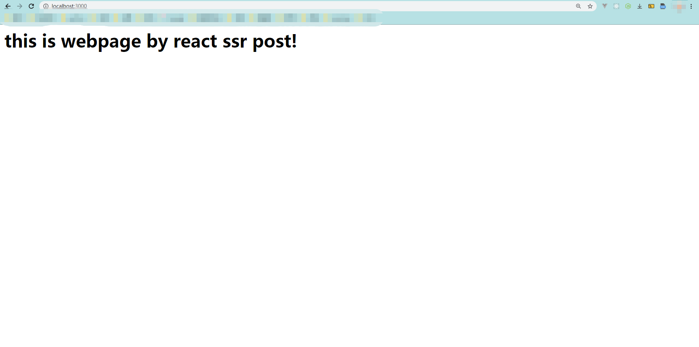

服务端渲染主要应用于vue和react。

服务端渲染就是返回给浏览器完整的html，而不是一个入口index.html。

一，思路：

在服务端，把首屏的react组件丢入ReactDOMServer.renderToString()中，生成字符串，然后丢入路由。

二，实现：

关键点：先把react代码用webpack编译成原生js，并且要采用commonjs规范编译。

1，webpack配置
```javascript
const path = require('path');
module.exports = {
    target: 'node',
    entry: './src/index.js',
    output: {
        filename: 'bundle.js',
        path: path.resolve(__dirname, 'build'),
        libraryTarget: "commonjs2"
    },
    module: {
        rules: [
        {
            test: /\.(js|jsx)$/,
            exclude: /node_modules/,
            use: {
            loader: "babel-loader"
            }
        }
        ]
    }
};
```
2，需要被编译的内容
```javascript
import React from 'react';
import ReactDOMServer from 'react-dom/server';
class Home extends React.Component{
    constructor() {
        super()
    }
    render() {
        return (
            <div>
                <h1>this is webpage by react ssr post!</h1>
            </div>
        )
    }
}
const content = ReactDOMServer.renderToString(<Home />);
export default content;
```
目前成熟的react服务端渲染的整体解决方案就是next.js。
# 步骤一：获取react组件编译打包后的js代码
```javascript
cd client 
cnpm i
npm build
```

# 步骤二：服务端返回请求结果
```javascript
cnpm i
npm start
http://localhost:3000/
```


